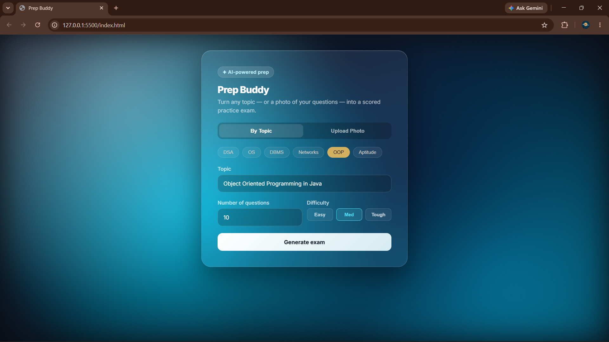
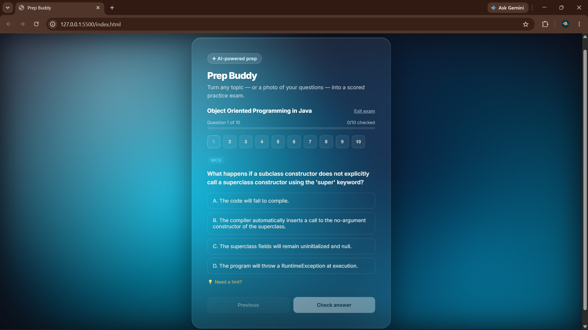
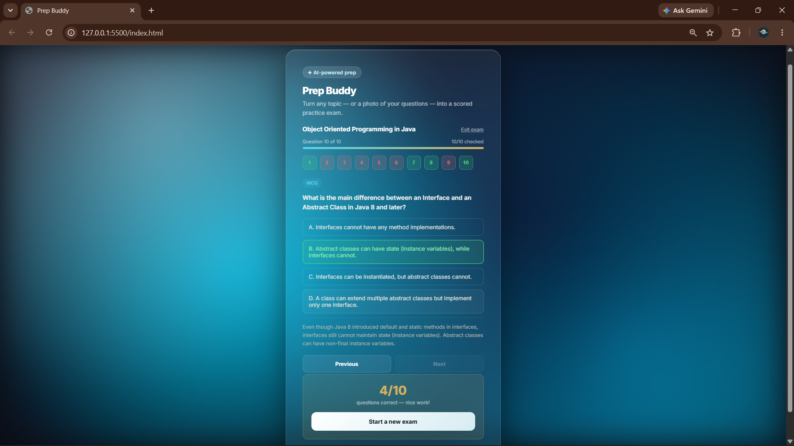

# Prep Buddy

An AI-powered exam prep tool that turns any topic — or a photo of a question paper — into a scored, interactive practice exam.

## What it does

- Pick a CS module (DSA, OS, DBMS, Networks, OOP, Aptitude) or type your own topic
- Choose difficulty (Easy / Medium / Tough) and how many questions you want
- Or upload a photo of a real question paper, and get fresh practice questions on the same concepts
- Answer MCQs one at a time, check each answer instantly, and see explanations + hints
- Get a final score once you've gone through the whole set

## Why I built it

I'm a 3rd-year CS student prepping for internships and exams. I wanted a tool that could generate targeted practice questions on demand instead of hunting for them online — so I built one, and used it to learn FastAPI and AI API integration along the way.

## Tech stack

- **Frontend:** HTML, CSS, JavaScript (vanilla, no framework)
- **Backend:** Python, FastAPI
- **AI:** Google Gemini API (multimodal — handles both text prompts and image input for the photo-upload feature)

## Key technical details

- **Structured AI output:** prompts are engineered to force the model to return strict JSON (question, options, correct answer index, explanation, hint) so the frontend can reliably render and score questions.
- **Retry + model fallback:** if Gemini's servers are busy (503 errors), the backend automatically retries and falls back across multiple model versions before giving up, so temporary outages rarely reach the user.
- **Image-based question generation:** photos are sent directly to Gemini's multimodal endpoint, which reads the question paper and generates new, similar questions — not just OCR + reuse.

## Running it locally

1. Clone the repo and open the folder
2. Create a virtual environment and install dependencies:
   ```
   pip install fastapi uvicorn google-genai python-dotenv python-multipart
   ```
3. Create a `.env` file in the project root with your own Gemini API key:
   ```
   GEMINI_API_KEY=your_key_here
   ```
4. Start the backend:
   ```
   uvicorn main:app --reload
   ```
5. Open `index.html` in your browser

## Screenshots

### Setup screen


### Taking the exam


### Results
